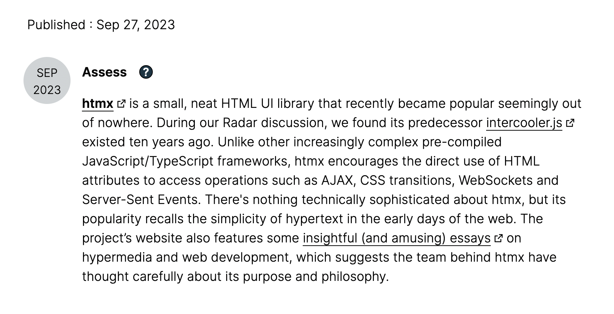
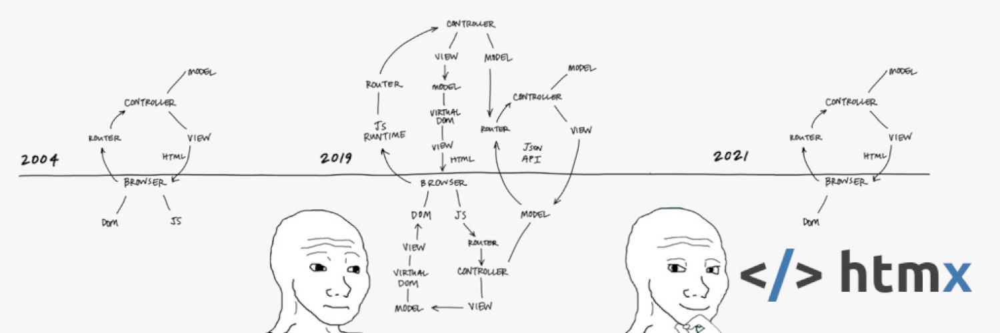
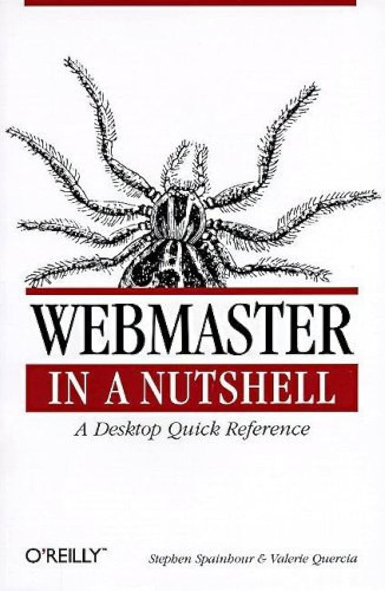
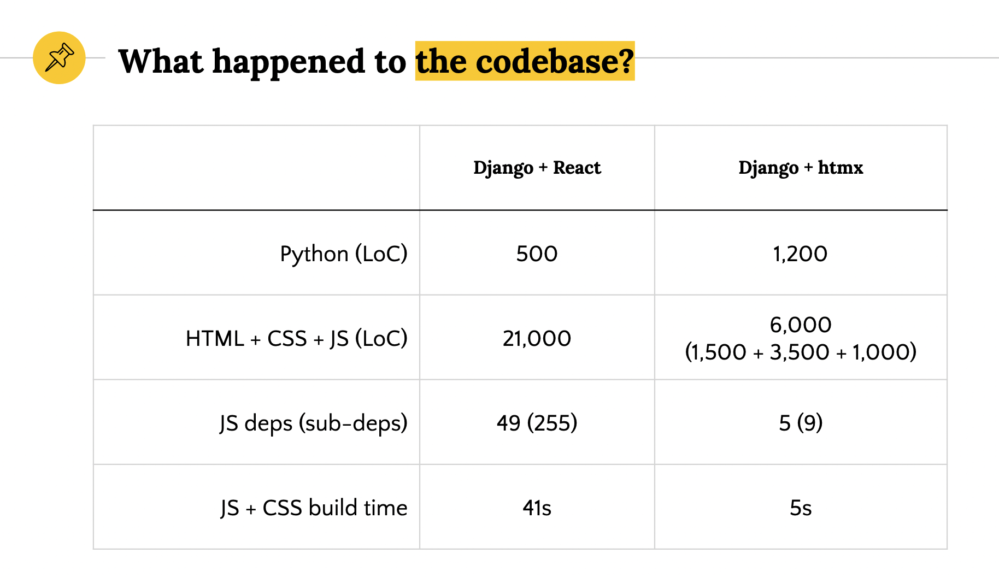
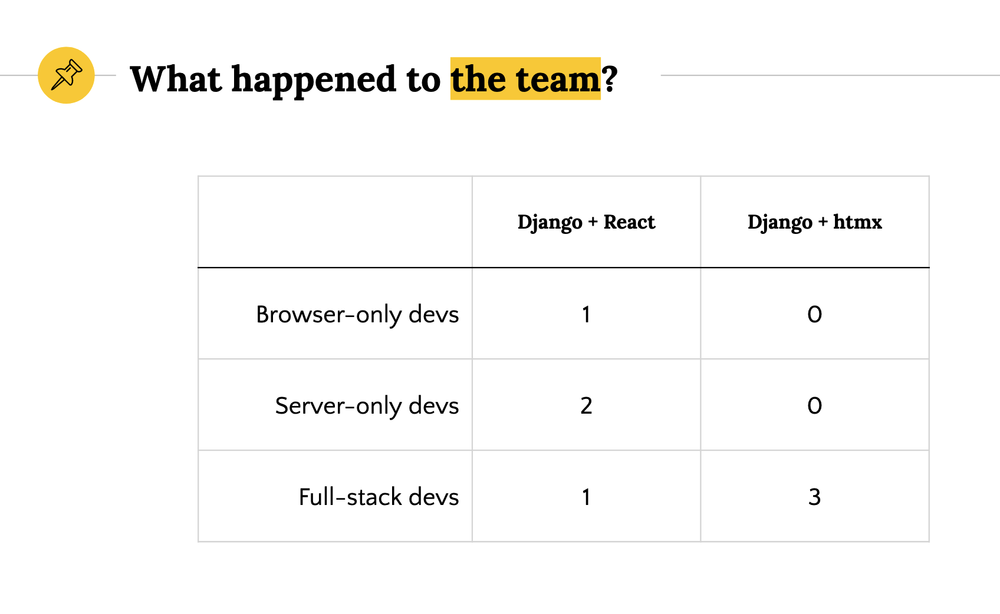
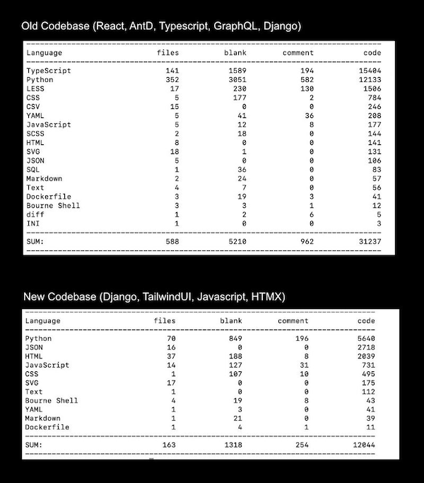
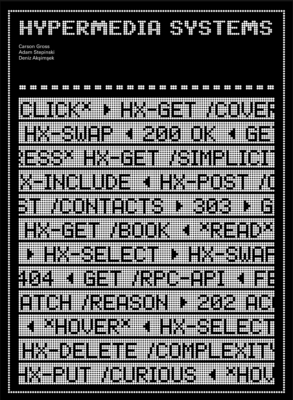

# <!--fit-->`</>`htmx & Hypermedia

*Confronting the Complexity of Frameworks and SPA Architectures*
*Is it Time to Return to Hypermedia ?*

Stefane Fermigier, Abilian // OSXP 2023

- Slides: <https://github.com/sfermigier/slides> / <https://fermigier.com/presentations/>
- Demo: <https://github.com/sfermigier/demos>

---

## Self introduction


<div style="font-size: 90%;">

- Web and Python developer since ~1996

- Know also (bits of) JavaScript, Java, C, C++, Clojure, PHP, Ruby...

- Founder and CEO (+ acting CTO) of Abilian since 2012

- Free/Open source user since 1988 (Nethack)

- Linux user since 1991

</div>

---

## What is htmx?

https://htmx.org (no wikipedia page!)

A single library:

- 15kB (compressed) JavaScript library, no dependencies
- Created by Carson Gross in 2020
- (Rewrite of Intercooler, started in 2014)

Helps implement hypermedia-driven applications (HDA),

---

## <!--fit--> Featured on the Thoughtworks Technology Radar



---

<!-- _backgroundColor: "#0e0e16;"	 -->


Source: [Fireship](https://www.youtube.com/watch?v=ANCm3oG7htM&t=327)

---

## Agenda

<div class="columns-center">
<div>

1. **A short history of the Web**

   1. From Hypermedia to back again.

2. **Hypermedia and htmx**

   1. Hypermedia fundamentals.
   2. htmx: the missing pieces to the current web.

</div>

<div>

3. **Using htmx**

   1. Front-end (HTML) patterns
   2. Server patterns

4. **htmx in practice**.

   1. Case studies
   2. Scaling htmx.

5. **Conclusion**

</div>
</div>

---

# <!--fit-->A short history of web technologies



---

## 1990-2000: The Dawn of Web Apps



- Early beginnings before CSS and JS dominance
- "Web developers" didn't exist - Web specialists were called "webmasters"

---

## 1996-2005: Emergence of New (Proprietary) Technologies in 2000s

- Arrival of ActiveX, Java applets, Flash, Silverlight
- App vs. website divide
- CSS and JS in their primitive stages
- XMLHttpRequest for HTML or XML exchange

---

## 2005-2015: The Web 2.0 Era

- Introduction of jQuery, AJAX ("Asynchronous JavaScript and XML") / AJAJ
- Decline of ActiveX, Flash unsupported on iPhone
- => Developers' challenge: Replicating Flash apps with HTML, CSS, JS
- Browser limitations: Lack of HTML5, CSS3, ES5, and JSON.parse
- IE8 and Chrome 1's limitations

---

## 2010-2020: The Rise of SPAs

- General adoption of HTML5, CSS3, ES5
- Shift in web traffic to mobile devices
- Rise of Single Page Applications (SPA)
  - Frameworks: Angular, Ember, Backbone, Knockout, React, Vue, Svelte, Solid, Alpine, Nue...
- Hypermedia apps renamed (by contrast) "MPA" (Multiple Pages Applications)

---

## <!--fit-->Since 2020: The Domination of SPAs and JSON APIs

- Traditional web frameworks now push JSON to the browsers (e.g. DRF, Flask-Rest*, etc.)
  - \+ New frameworks focused on JSON APIs: FastAPI, Sanic, Litestar...
- Server frameworks adapting to "HTML for apps" approach
  - Rise of Blazor, Phoenix LiveView, Livewire, htmx...
- Innovations and complexities introduced by SPAs.

=> Seeking the balance of flexibility and simplicity.

---

# Hypermedia Systems & htmx

---

## Hypermedia Systems

A hypermedia system is a system that adheres to the **RESTful network architecture** in Fielding’s original sense of this term, and in particular to the [HATEOAS](https://htmx.org/essays/hateoas/) (Hypermedia as the engine of application state) principles.

NB: “REST” shouldn't be confused with "JSON APIs". JSON is not a natural hypermedia due to the absence of hypermedia controls. The exchange of hypermedia is (according to Gross) an explicit requirement for a system to be considered “RESTful.”

<!--
AKA: "le web à papa"
-->

---

## <!--fit--> Limitations of Traditional ("Web 1.0") Hypermedia

- Why should only `<a>` and `<form>` be able to make HTTP requests?
- Why should only `click` & `submit` events trigger them?
- Why should only `GET` & `POST` methods be available?
- Why should you only be able to replace the entire screen?

<!--
- Limited Element Interaction: In Web 1.0 applications, users can only manipulate HTML (Hypermedia control) with `<a>` and `<form>`. Other elements like buttons lacked this capability.

- Restricted Event Triggers: Traditional HTML hypermedia only reacts to specific events like click (for anchors) and submit (for forms). Other DOM events like mouse down or key up couldn't trigger HTTP requests.

- Constrained HTTP Methods: HTML primarily supports GET and POST methods, limiting access to DELETE, PUT, and PATCH.

- Whole Page Replacement: Clicking a hyperlink typically replaces the entire screen, leading to a poor user experience with issues like flash of unstyled content, disrupted scroll state, and loss of focus.
-->

---

## How htmx Solves these Four Problems?

<div class="columns-center">
<div>

Any element should be able to make HTTP requests

- `hx-get`, `hx-post`, `hx-put`, `hx-patch`, `hx-delete`

Any event should be able to trigger an HTTP request

- `hx-trigger`

</div>

<div>

Any HTTP Action should be available

- `hx-put`, `hx-patch`, `hx-delete`

Any place on the page should be replaceable

- `hx-target`, `hx-swap`

</div>
</div>

---

## Benefits of Introducing htmx

htmx solves all these four problems elegantly and without demanding developers write JavaScript code.

> htmx gives access to "AJAX", CSS Transitions, browser history, WebSockets and Server Sent Events directly in HTML, using only attributes, so you can build modern user interfaces ("SPA-like") with the simplicity and power of hypertext

---

# Front-End Patterns / Examples

---

## Getting started

```html
<script src="https://unpkg.com/htmx.org@latest"></script>
```

(45 kB minified, 15 kB gzipped)

---

## `hx-boost`

`hx-boost` allows you to “boost” normal anchors and form tags to use AJAX instead. It works even with JavaScript disabled.

```html
<div hx-boost="true">
  <a href="/page1">Go To Page 1</a>
  <a href="/page2">Go To Page 2</a>
</div>
<!-- or -->
<form hx-boost="true" action="/example" method="post">
  <input name="email" type="email" placeholder="Enter email...">
  <button>Submit</button>
</form>
```

---

## AJAX and HTTP methods

```html
<div id="contacts">
  <button hx-get="/contacts" hx-target="#contacts">
    Get The Contacts
  </button>
</div>
```

<div style="font-size: 80%;">

- `hx-get` — send GET request to the provided URL
- `hx-post` — send POST request to the provided URL
- `hx-put` — send PUT request to the provided URL
- `hx-patch` — send PATCH request to the provided URL
- `hx-delete` — send DELETE request to the provided URL

</div>

---

## Triggers

Browser events can trigger htmx actions:

```html
<div id="contacts"></div>

<button 
    hx-get="/contacts" hx-target="#main" 
    hx-swap="outerHTML" hx-trigger="mouseenter">
  Get The Contacts
</button>
```

---

## Trigger modifiers

The `hx-trigger` attribute accepts an additional modifier to change the behavior of the trigger, including:

<div style="font-size: 90%;">

- `once` — ensures a request will only happen once
- `changed` — issues a request if the value of the HTML element has changed
- `delay:<time interval>` — waits for the given amount of time before issuing the request
- `from:<CSS Selector>` — listens for the event on a different element
- ...

</div>

---

# <!--fit-->Server-Side Patterns

---

## Search example (server)

```python
@blueprint.get("/search")
def search():
    q = request.args.get("q", "").strip()
    talks = get_talks(q)

    if request.headers.get("HX-Trigger") == "search":
        return render_template("search/_rows.html", talks=talks)

    return render_template("search/index.html", talks=talks)
```

---

## Search example (`search/index.html`)

```jinja
  <input
      id="search" type="search" name="q"
      placeholder="Enter title or speaker"
      value="{{ request.args.get('q') or '' }}"
      {# htxm specific attrs #}
      hx-get="{{ url_for('.search') }}"
      hx-trigger="search, keyup delay:400ms changed"
      hx-target="tbody" hx-push-url="true" />
  <table>
    <thead>...</thead>
    <tbody>
    
    </tbody>
  </table>
```

---

## Search example (`search/_rows.html`)

```jinja

  <tr>
    <td>{{ talk.title }}</td>
    <td>{{ talk.presenter }}</td>
  </tr>

  <tr>
    <td colspan="2">
      No relevant announcements
    </td>
  </tr>

```

---

## Discussion

Template generation should respect the "Locality of Behaviour" (LoB) principle.

> The behaviour of a unit of code should be as obvious as possible by looking only at that unit of code

Splitting the templates should be done a a way the respects this principle. Some patterns have emerged (see, e.g., [Django htmx patterns](https://github.com/spookylukey/django-htmx-patterns)) but rely on specifics features of templates languages or extensions. (No time to discuss today),

---

## Quick-and-dirty alternative

<!--_footer: ""-->

```python
@blueprint.get("/search")
def search():
    q = request.args.get("q", "").strip()
    talks = get_talks(q)
    return render_template("search/index.html", talks=talks)
# with
def after_app_request(response):
    if "HX-Request" in request.headers:
        data = response.get_data()
        tree = html.fromstring(data, parser=parser)
        target = request.headers["HX-Target"]
        target_elem = tree.xpath(f"//*[@id='{target}']")[0]
        oob_elems = tree.xpath("//*[@hx-swap-oob]")
        elems = [target_elem] + oob_elems
        response.data = "".join([html.tostring(elem, encoding=str) for elem in elems])
    return response
```

---

# <!--fit-->Experience Reports

---

## Contexte (2022)

<!-- _footer: ""-->

<div style="font-size: 70%">

- The effort took about 2 months (from a 21K LOC code base)
- No reduction in the application’s UX
- **Reduced the overall code base size by 67%**
- Increased python code by 140% (500 LOC to 1200 LOC) - a good think if you like Python
- First load time-to-interactive reduced by 50-60%
- Handles much larger data sets (react simply couldn’t handle the data)
- Web application memory usage was reduced by 46% (75MB to 45MB)

</div>




---

## OpenUnited (2023)

<!-- _footer: ""-->



<div style="font-size: 80%;">

- Code base size **reduced by 61%** (31237 LOC to 12044 LOC)
- Subjectively, **development velocity felt at least 5X faster**
- Rather than prototyping in Figma and then porting to HTML, UX development was done directly in HTML

Source: [Linkedin post](https://www.linkedin.com/feed/update/urn:li:activity:7109116330770878464/)

Code base (before/after): https://github.com/OpenUnited/

</div>

---

## Abilian

- htmx introduced in ongoing projects (sometimes alongside AlpineJS)
- Ongoing rewrite of older jQuery- and Vue-based projects
- Demos on <https://github.com/sfermigier/demos>
- [webbits](https://github.com/abilian/webbits): an open source component framework and library for Python & htmx (ongoing project)

---

## When and Why to Use htmx / HDA?

<div style="font-size: 80%;">

- **Ideal for Low-Interactivity Sites**: Best for text and image-based sites (e.g., Amazon, eBay, news sites).
- **Server-Side Value Addition**: Great for applications relying on server-side processing and data analysis.
- **Large-Grain Data Transfers**: All applications which use anchor tags and forms, with responses that return entire HTML documents from requests.
- **Wide Application Range**: Suitable for a variety of applications, extending beyond basic content display sites.
- **Simplifies Client-Side Complexity**: Reduces the need for client-side routing, state management, and JavaScript logic.

</div>

---

## When and Why Not to Use Hypermedia?

<div style="font-size: 90%;">

- **Highly Dynamic Interfaces**: online spreadsheets (where updates trigger cascading changes), games...
- **Performance Concerns**: Hypermedia can reduce performance in situations requiring rapid, dynamic updates on user interactions.
- **Complex User Interface Dynamics**: Ineffective for interfaces without clear update boundaries, needing continuous data refresh.
- **Avoid for Large-Grain Data Inefficiency**: Not ideal for applications where the "large-grain hypermedia data transfer" model is too coarse.
- **Use Case for Sophisticated Client-Side JavaScript**: Better to use advanced client-side JavaScript for complex, interactive elements.

</div>

---

## Mixing and Mashing

You can still use JavaScript (or Hyperscript) to provide (presumably lightweight) interactivity on the client (ex: hamburger menus, rich-text editors, complex data-grid, image editor...) in a context of an HDA / MPA, htmx-based (or not), application.

A DX issue can be the confusion that can appear from mixing 2 different template languages (*e.g.* Jinja and Vue or Alpine).

AlpineJS or Web Components are approaches that can be seen in the wild (and that I have personally experimented).

---

## Short example using Hyperscript

```jinja


<script src="https://unpkg.com/hyperscript.org@0.9.12"></script>
<script src="https://cdn.jsdelivr.net/npm/sweetalert2@11"></script>
<button 
    hx-delete="/post{{post.id}}"
    _="on htmx:confirm(issueRequest)
        halt the event
        call Swal.fire({
            title: 'Confirm', text:'Do you want to delete this post?'
        })
        if result.isConfirmed issueRequest()
    ">Delete</button>

```

<!--_footer: ""-->

---

## Carson Gross recommends

> The prime directive of an HDA is to use Hypermedia As The Engine of Application State. A hypermedia-friendly scripting approach will follow this directive.

> Practically, this means that scripting should avoid making non-hypermedia exchanges over the network with a server.

> hypermedia-friendly scripting should avoid the use of `fetch()` and `XMLHttpRequest` unless the responses from the server use a hypermedia of some sort (`e.g.` HTML), rather than a data API format (`e.g.` plain JSON).

<!-- _footer: ""-->

---

## In any Case

- **Use Hypermedia for Simpler App Parts**: Can be beneficial for simpler parts of an app, like settings pages with straightforward forms.
- **Manage Your Complexity Budget**: Reserve hypermedia for simpler application aspects, allocating more complexity to critical, intricate functionalities.

---

# <!-- fit -->Scaling htmx

---

## Scaling Hypermedia-Driven Applications

- Common skepticism: HDAs (and htmx) won’t scale for large projects
- Scaling? = handling more nodes, requests, features, complexity, and team size
- The Web as the most successful and large scale distributed system
  - Hypermedia's role in the Web's scalability
  - Importance to individual developers

---

## Scaling Application Performance in HDAs

- Conditions for scaling efficiently:
  - Software should be stateless
  - Software should support horizontal scaling
  - Features in the software should be independent
  - The performance of the system should be observable
  - The software should utilize caching
- HDA ticks all the boxes

---

## Scaling with Number of Features in HDAs

- Independent endpoints driven by UI needs
- MVC architecture fostering scalability
- Server-side includes for view reuse
- Decoupled feature development

---

## Scaling with Complexity of Features in HDAs

- Distinction between server-side and client-side deep features
- HDAs are well suited for server-side complex features
- HDAs are less suited for client-side intense UI interactions
- In which case the architecture should enable integrating complex front-end behavior developped using client-side technologies (JavaScript, WASM...)

---

## Scaling the Development Team in HDAs

- Anecdotal evidence suggests fewer developers needed
- Elimination of front-end/back-end split
- Preference for smaller, more efficient teams
- But larger teams should be OK too

---

# <!--fit-->References

---



## Hypermedia systems

<!-- _footer: ""-->

Book written by Carson Gross & co-authors.

<div style="font-size: 0.8em; margin-top: 1em;">
"Learn how hypermedia, the revolutionary idea that created The Web, can be used today to build modern, sophisticated web applications, often at a fraction of the complexity of popular JavaScript frameworks."
</div>

Freely available on <https://hypermedia.systems/>

---

## Projects

<div class="columns-center" style="font-size: 80%">
<div>

**Python projects or extensions**:

- [Flask-htmx](https://pypi.org/project/flask-htmx-fork/) (Flask extension)
- [Django htmx](https://django-htmx.readthedocs.io/en/latest/) (Django extension)
- [hx-request](https://hx-requests.readthedocs.io/) (Django extension)
- [Litestar htmx](https://docs.litestar.dev/latest/usage/htmx.html) (1st party support)
- ...

</div>

<div>

**Alternatives to htmx**:

- [Hotwired](https://hotwired.dev/)
- [Inertia](https://inertiajs.com/) (Larave)
- [Livewire](https://livewire.laravel.com/) (Laravel)
- Many others

</div>

---

## Other useful references

- [Essays on htmx.org](https://htmx.org/essays/)
- [Django + htmx patterns](https://github.com/spookylukey/django-htmx-patterns/)
- More:
  - [Server-Side Examples on htmx.org](https://htmx.org/server-examples/)
  - [PyHAT: Awesome Python htmx](https://github.com/PyHAT-stack/awesome-python-htmx)

---

# <!-- fit -->Conclusion

---

## Your turn!

Embrace htmx and HDA in Modern Web Development!

- In many cases, htmx is a viable alternative to SPAs.
- It balances performance, simplicity, and scalability.
- Future prospects for htmx and hypermedia in large-scale projects.

---

<!-- _footer: "" -->

<style scoped>
  h1 { font-size: 3.5em; }
</style>

# Merci!

<div style="font-size: 95%">

Credits: a large part of the content of this presentation is derived from the htmx.org and hypermedia.systems websites. Errors are mine.

Contact:

- sf@abilian.com / https://abilian.com/
- sf@fermigier.com / https://fermigier.com/

Slides created with [MARP](https://marp.app/).

</div>